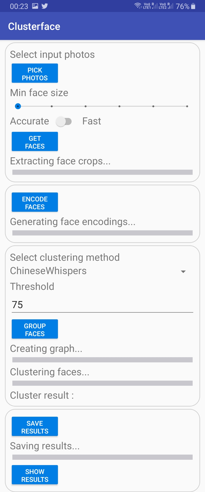
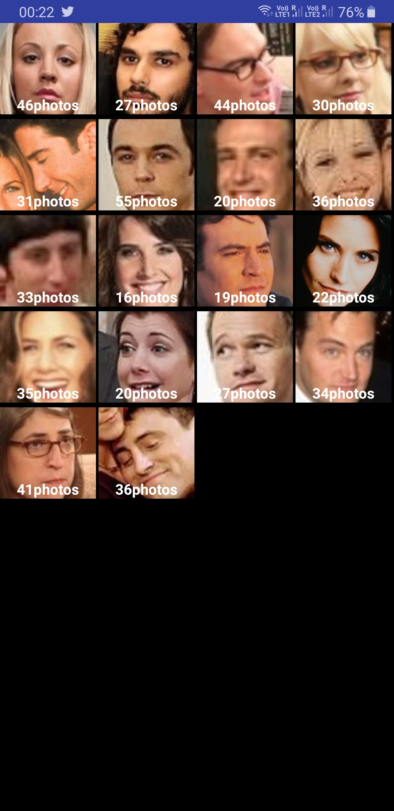

# Clustering faces in android
This project demonstrates an android application that detects faces in photos, generates facenet encodings 
and clusters faces belonging to recognized individuals.

## Introduction
* This is Part II of a two-part series for Face Clustering on Android.
* [Firebase ML Kit](https://firebase.google.com/products/ml-kit) is used for on-device face detection.
* [Tensorflow Lite](https://www.tensorflow.org/lite) is used for on-device inference. 
(Scripts to port [facenet](https://github.com/davidsandberg/facenet) models to tflite are present in [Part I](https://github.com/njordsir/Clustering-Faces))
* Several Clustering algorithms are implemented to group faces including a concise implementation of [Chinese Whispers](https://en.wikipedia.org/wiki/Chinese_Whispers_(clustering_method))
* This appears to be the only publically available facenet porting to android and all components have been developed from scratch.

## Features
* Select photos to process in-app or directly add photos to external storage -> Clusterface -> Input
* Face crops and clustering results are saved to their respective folders.
* Select between Chinese Whispers, KMeans and DBScan clustering.
* Interactive gallery view for results

## Screenshots

  
  

## Notes
* All the observations made in [Part I](https://github.com/njordsir/Clustering-Faces) hold here as well
* Try to test significantly-sized collections of personal photos with ChineseWhispers clustering for best results.

## TODO
1. Results have to be inspected via the file manager. Will add a gallery view to showcase results. [Done]
2. Will add background processes for most computation and app view will only consist of a Google Photos like interface.
3. Several major features remain to be added.

## Downloads
* Install and test on device with [apk](https://drive.google.com/open?id=1TV8l__T8WhGV4346MRfYazi0D_mB9se-)
